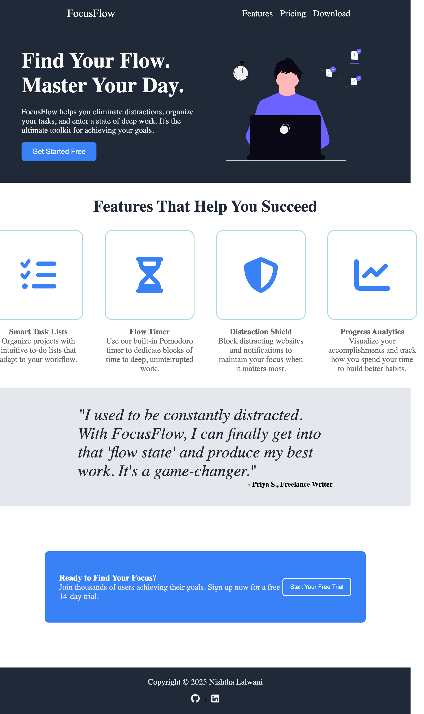

# FocusFlow - Landing Page

A sleek and modern landing page for FocusFlow, a productivity tool designed to help users enter deep work states. This project was built to demonstrate foundational HTML and CSS skills, with a focus on creating a clean layout using Flexbox.

### [Live Demo]([https://nish0024.github.io/landing-page/)

---

## About The Project

This project is a complete landing page built from scratch using HTML and CSS. The goal was to create a professional-looking, responsive page for a fictional SaaS product. The layout is structured into several key sections, including a hero, features, a testimonial, and a call-to-action block.

## Key Features

- **Clean Hero Section:** A welcoming introduction with a clear call-to-action.
- **Informative Feature Cards:** A section showcasing the product's main features with icons from Font Awesome.
- **Inspirational Quote Block:** A styled testimonial section to build trust.
- **Clear Call-to-Action:** A final, prominent section to encourage user conversion.
- **Responsive Design:** The layout is built with Flexbox for adaptability across different screen sizes.

## Technologies Used

- 
- 
- **Flexbox** for layout and alignment.
- **Font Awesome** for icons.

## What I Learned

Through this project, I gained significant experience in:

- Structuring a webpage with semantic HTML5.
- Utilizing CSS Flexbox to create complex and responsive layouts.
- Implementing a clean and modern design aesthetic from a concept.
- Integrating third-party libraries like Font Awesome for icons.
- Writing and organizing a clean, maintainable CSS stylesheet.

## Acknowledgements

- This project was inspired by the curriculum at The Odin Project.
- Icons provided by [Font Awesome](https://fontawesome.com/).
- Hero image generated using AI.

## Contact

Nishtha Lalwani - [GitHub](https://github.com/nish0024) | [LinkedIn](https://www.linkedin.com/in/nishtha-lalwani-b05943288/)